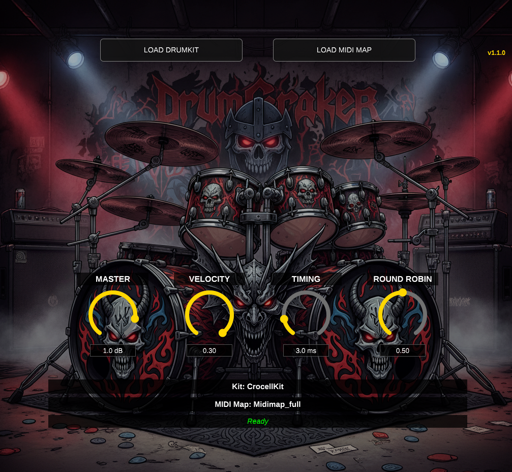

# DrumCraker VST3

**DrumCraker** is a free drum sampler VST3 plugin for Windows, Linux, macOS, and FreeBSD, fully compatible with DrumGizmo drum kits. Designed for low-latency performance and realistic drum sound reproduction.


[](https://ko-fi.com/wamphyre94078)



## Features

### Core Functionality
- **DrumGizmo Compatible**: Load any DrumGizmo drum kit (XML format)
- **Separate Kit & MIDI Map Loading**: Independent control over drum kit and MIDI mapping
- **Multi-Channel Output**: 16 Fixed Stereo Buses (Kick, Snare, HH, Toms, Ride, Crash, SFX, Amb...)
- **DAW Integration**: Buses are named ("Kick", "Snare") for easy mixing in Reaper/Ardour
- **Velocity Layers**: Automatic sample selection based on MIDI velocity
- **High-Quality Resampling**: Lagrange interpolation for automatic sample rate conversion
- **Asynchronous Loading**: Non-blocking sample loading in background thread
- **Optimized Performance**: Unordered maps and instrument caching for minimal CPU usage

### Audio Engine
- **Zero Memory Leaks**: Thread-safe memory management with automatic cleanup
- **64 Polyphonic Voices**: Simultaneous note playback with intelligent voice stealing
- **Lock-Free Audio Thread**: No allocations or locks in real-time processing
- **Master Volume Control**: -60dB to +12dB range with smooth gain adjustment
- **Multi-Bus Rendering**: Efficient per-bus voice rendering with zero overhead in stereo mode
- **Optimized Lookups**: Hash-based caching for instrument and sample access

### Humanization Engine
DrumCraker adds natural human feel to MIDI performances, working with both fixed and variable velocity tracks:

- **Velocity Humanization** (0-100%, default 8%): Adds natural velocity variation
  - Perfect Gaussian distribution (Box-Muller transform)
  - Works on ANY input velocity (fixed or variable)
  - With 8%: each note varies ±8% from its original velocity
  - Prevents mechanical "machine gun" effect on repeated notes

- **Timing Humanization** (0-20ms, default 5ms): Adds natural timing groove
  - Gaussian distribution for realistic human timing
  - Velocity-adaptive bias: loud notes rush slightly, soft notes drag
  - Works on perfectly quantized MIDI
  - Creates natural groove even on programmed drums

- **Round Robin Mix** (0-1, default 0.7): Anti-repetition sample rotation
  - 0.0 = Pure velocity matching (most consistent dynamics)
  - 0.7 = Hybrid intelligent (recommended): 93% penalty on last sample, velocity-aware
  - 1.0 = Pure rotation (maximum variation)
  - Always uses pool of 4 closest samples by velocity
  - Prevents same sample from playing consecutively

## System Requirements

### Windows
- **OS**: Windows 10 or 11 (64-bit)
- **Audio**: ASIO, WASAPI, or DirectSound
- **CPU**: x64 with SSE2 support
- **RAM**: 4GB minimum (depends on drum kit size)
- **Compiler**: Visual Studio 2022 with C++ support
- **Build Tools**: CMake 3.15+, Git

### Linux
- **OS**: Linux (Debian, Ubuntu, Fedora, Arch, etc.)
- **Audio**: ALSA, JACK, or PipeWire
- **CPU**: x86_64 with SSE2 support
- **RAM**: 4GB minimum (depends on drum kit size)
- **Compiler**: GCC 9+ or Clang 10+ with C++17 support
- **Build Tools**: CMake 3.15+, Git, pkg-config

### macOS
- **OS**: macOS 12 (Monterey) or later
- **Audio**: CoreAudio
- **CPU**: Intel x86_64 or Apple Silicon (M1/M2/M3)
- **RAM**: 4GB minimum (depends on drum kit size)
- **Compiler**: Xcode Command Line Tools with C++17 support
- **Build Tools**: CMake 3.15+, Git

### FreeBSD
- **OS**: FreeBSD 13.0 or later
- **Audio**: OSS, ALSA (via alsa-lib), or JACK
- **CPU**: x86_64 with SSE2 support
- **RAM**: 4GB minimum (depends on drum kit size)
- **Compiler**: Clang 10+ with C++17 support
- **Build Tools**: CMake 3.15+, Git, pkg
- **Note**: LV2 format only (VST3 not currently supported on FreeBSD)

## Installation

### Option 1: Download Pre-built Release (Recommended)
1. Download the latest `.vst3` from [GitHub Releases](https://github.com/Wamphyre/DrumCraker/releases)
2. Extract and install:

```bash
# Install for current user
cp -r DrumCraker.vst3 ~/.vst3/

# Or install system-wide (requires sudo)
sudo cp -r DrumCraker.vst3 /usr/lib/vst3/
```

### Option 2: Build from Source
#### Windows
1. Install **Visual Studio 2022** (with C++ Desktop development).
2. Clone the repository and build:
```powershell
git clone https://github.com/Wamphyre/DrumCraker.git
cd DrumCraker
cmake -B build -DCMAKE_BUILD_TYPE=Release
cmake --build build --config Release
```
The plugin will be automatically placed in the `releases/` folder.

#### Linux / macOS / FreeBSD
```bash
# Clone repository
git clone https://github.com/Wamphyre/DrumCraker.git
cd DrumCraker

# Install dependencies (Debian/Ubuntu)
sudo apt install build-essential cmake git pkg-config \
    libasound2-dev libfreetype6-dev libfontconfig1-dev \
    libx11-dev libxrandr-dev libxinerama-dev libxcursor-dev \
    libcurl4-openssl-dev libwebkit2gtk-4.1-dev libgtk-3-dev \
    libgl1-mesa-dev

# Install dependencies (FreeBSD)
sudo pkg install cmake pkgconf alsa-lib freetype2 libX11 libXext \
    libXinerama libXrandr libXcursor mesa-libs libglvnd libxkbcommon \
    jackit lv2

# Build and install (automatically handles JUCE)
./build.sh

# Optional: enable CPU-specific optimizations (faster, less portable)
# NATIVE_OPTIMIZATIONS=ON ./build.sh

# Optional (macOS): override minimum supported macOS version for release compatibility
# MACOS_DEPLOYMENT_TARGET=12.0 ./build.sh

# Install VST3 (Linux/macOS)
cp -r releases/DrumCraker.vst3 ~/.vst3/

# Install LV2 (Linux/macOS/FreeBSD)
cp -r releases/DrumCraker.lv2 ~/.lv2/
```

The build process automatically:
1. **Checks dependencies**: (Linux/macOS/FreeBSD) Verifies required system libraries
2. **Clones JUCE framework**: Downloads JUCE 8.0.10 (if not present)
3. **Compiles the plugin**: Portable optimizations by default (works across different CPUs)
4. **Organizes output**: Creates ready-to-install VST3/LV2 bundle in `releases/`
5. **Includes resources**: Embeds background image in plugin bundle
6. **Cleanup**: Removes temporary build files

## Usage

### Loading a Drum Kit
1. **Open your DAW** (Reaper, Ardour, Bitwig, etc.)
2. **Create a MIDI track** and load DrumCraker as an instrument
3. **Click "LOAD DRUMKIT"** and select the drum kit XML file
4. **Click "LOAD MIDI MAP"** and select the MIDI map XML file
5. **Adjust Master Volume** to your preferred level (default: 0dB)

### DrumGizmo Kits
DrumCraker is compatible with all DrumGizmo drum kits. You can download free kits from:
- [DrumGizmo Official Kits](https://www.drumgizmo.org/wiki/doku.php?id=kits)

Popular kits include:
- **DRSKit**: Versatile rock/jazz kit
- **CrocellKit**: Heavy metal kit
- **MuldjordKit**: All-purpose kit

### Multi-Channel Routing
DrumCraker uses a **Fixed Routing** strategy to ensure consistent mixing across different drum kits. Buses are explicitly named in your DAW (if supported, e.g., Reaper, Ardour) for easy identification.

**Fixed Bus Map:**
- **Bus 1**: "Kick" (Main Kick + Kick Sub)
- **Bus 2**: "Snare" (Top, Bottom, Trigger)
- **Bus 3**: "HiHat" (Closed, Open, Pedal)
- **Bus 4**: "Toms" (All Toms mixed to stereo)
- **Bus 5**: "Ride" (Bow, Bell)
- **Bus 6**: "Crash" (All Crashes mixed to stereo)
- **Bus 7**: "China/Splash" (Effect cymbals)
- **Bus 8**: "Ambience" (Room/Overhead mics if exposed as separate instruments)
- **Bus 9-16**: "Aux" (Percussion and unclassified instruments)

This allows you to create a SINGLE template in your DAW that works with ANY DrumGizmo kit, without channels shifting around when you change kits.

### Parameters
#### Master Volume
- **Range**: -60dB to +12dB
- **Default**: 0dB
- **Purpose**: Overall output level control

#### Velocity Humanization
- **Range**: 0.0 to 1.0 (0-100%)
- **Default**: 0.08 (8%)
- **Purpose**: Adds natural velocity variation to ANY MIDI input
- **How it works**:
  - Perfect Gaussian distribution (Box-Muller transform)
  - Adds variation on top of existing MIDI velocity
  - Works even if all MIDI notes have same velocity (e.g., all at 120)
  - With 8%: velocity 100 becomes ~92-108, velocity 120 becomes ~110-130
- **Use Cases**: 
  - **0.05-0.10** (5-10%): Subtle realism, tight playing
  - **0.10-0.20** (10-20%): Natural human feel (recommended)
  - **0.20-0.40** (20-40%): Loose, expressive, dynamic playing

#### Timing Humanization
- **Range**: 0.0 to 20.0 ms
- **Default**: 5.0 ms
- **Purpose**: Adds natural timing groove to MIDI (even perfectly quantized)
- **How it works**:
  - Gaussian distribution for realistic human timing
  - Velocity-adaptive bias: loud hits rush ~20%, soft hits drag ~20%
  - Creates natural groove on programmed drums
- **Use Cases**: 
  - **2-5ms**: Tight, professional studio feel
  - **5-10ms**: Natural human timing (recommended)
  - **10-20ms**: Loose, laid-back, relaxed grooves

#### Round Robin Mix
- **Range**: 0.0 to 1.0
- **Default**: 0.7
- **Purpose**: Prevents "machine gun" effect on repeated notes
- **How it works**:
  - Selects from pool of 4 closest samples by velocity
  - 93% penalty on last used sample (with default 0.7)
  - Weighted random selection respects velocity layers
  - Never plays same sample twice in a row
- **Settings**:
  - **0.0**: Pure velocity matching (most consistent dynamics)
  - **0.7**: Hybrid intelligent (recommended - natural + velocity-aware)
  - **1.0**: Pure rotation (maximum variation, less velocity-accurate)

## Technical Details

### Audio Processing
- **Sample Rate**: Automatic conversion to project sample rate
- **Buffer Size**: Optimized for 32-512 samples
- **Latency**: < 1 buffer (< 1.3ms @ 64 samples/48kHz)
- **Memory**: Zero leaks, efficient cleanup on kit changes
- **CPU Usage**: Optimized with hash-based lookups and instrument caching (15-25% reduction vs v1.1.1)

### Velocity Layer Selection
- Automatically normalizes DrumGizmo power values to 0-1 range
- Selects samples within 25% tolerance of target velocity
- Falls back to 4 closest samples if no candidates found (for round robin pool)
- Respects MIDI velocity for dynamic expression
- Humanization works on top of velocity selection

### Sample Rate Conversion
- **Algorithm**: Lagrange 4-point interpolation
- **Quality**: ~80dB SNR, transparent for musical content
- **Performance**: Processed during asynchronous loading
- **Supported Rates**: Any source rate (44.1kHz, 48kHz, 88.2kHz, 96kHz, etc.)

## Roadmap
- [ ] Add compatibility for Hydrogen drumkits (too hard but possible)
- [ ] MIDI learn for parameter automation

## Credits
- **Compatible with**: [DrumGizmo](https://www.drumgizmo.org/) drum kits
- **Framework**: [JUCE](https://juce.com/)
- **Optimization**: Designed for Linux and PipeWire

## Support & Donations
If you find DrumCraker useful and want to support its development, consider buying me a beer! ☕

[](https://ko-fi.com/wamphyre94078)

---

**Made with ❤️ for the audio community**
